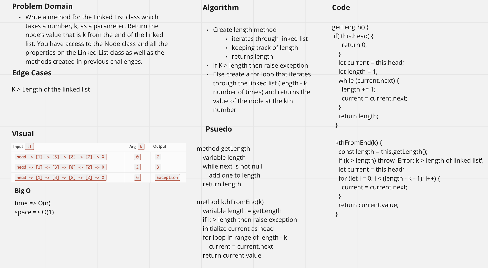

# Singly Linked List js implementation

## April 26 Challenge Summary
<!-- Short summary or background information -->
Implement insertion methods in Linked List class & write tests.

### Challenge Description
<!-- Description of the challenge -->
Write the following methods for the Linked List class:

- .append(value) which adds a new node with the given value to the end of the list
- .insertBefore(value, newVal) which add a new node with the given newValue immediately before the first value node
- .insertAfter(value, newVal) which add a new node with the given newValue immediately after the first value node

### Approach & Efficiency
<!-- What approach did you take? Why? What is the Big O space/time for this approach? -->
Time -> O(n)
Space -> O(1)

### Solution
<!-- Embedded whiteboard image -->

---

## April 27 Challenge Summary
<!-- Short summary or background information -->
Implement kthFromEnd(k) method in Linked List class & write tests.

### Challenge Description
<!-- Description of the challenge -->
Write a method for the Linked List class which takes a number, k, as a parameter. Return the node’s value that is k from the end of the linked list. You have access to the Node class and all the properties on the Linked List class as well as the methods created in previous challenges.

### Approach & Efficiency
<!-- What approach did you take? Why? What is the Big O space/time for this approach? -->
Time -> O(n)
Space -> O(1)

### Solution
<!-- Embedded whiteboard image -->

