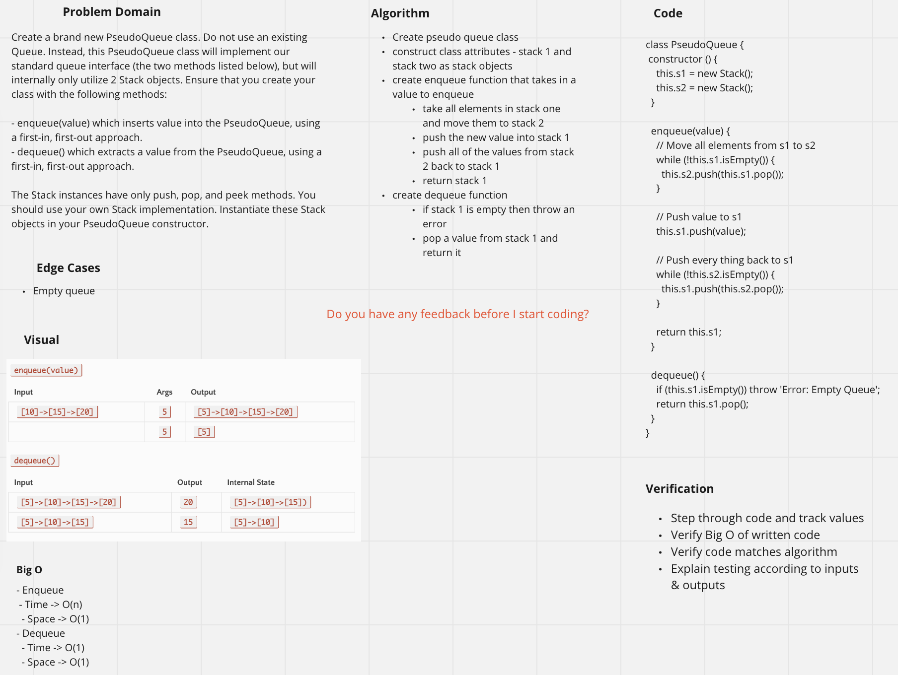
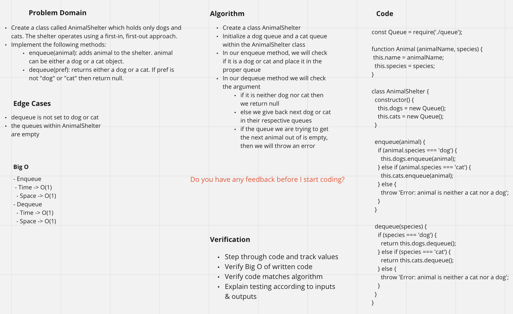

# Stacks and Queues

## Challenge Summary 5/3/2021
<!-- Short summary or background information -->
Create a queue using two stacks

## Challenge Description
<!-- Description of the challenge -->
Create a brand new PseudoQueue class. Do not use an existing Queue. Instead, this PseudoQueue class will implement our standard queue interface (the two methods listed below), but will internally only utilize 2 Stack objects. Ensure that you create your class with the following methods:

- enqueue(value) which inserts value into the PseudoQueue, using a first-in, first-out approach.
- dequeue() which extracts a value from the PseudoQueue, using a first-in, first-out approach.

The Stack instances have only push, pop, and peek methods. You should use your own Stack implementation. Instantiate these Stack objects in your PseudoQueue constructor.

## Approach & Efficiency
<!-- What approach did you take? Why? What is the Big O space/time for this approach? -->
- Enqueue
  - Time -> O(n)
  - Space -> O(1)
- Dequeue
  - Time -> O(1)
  - Space -> O(1)

## Solution
<!-- Embedded whiteboard image -->

---

## Challenge Summary 5/4/2021
<!-- Short summary or background information -->
First-in, First out Animal Shelter.

## Challenge Description
<!-- Description of the challenge -->
Create a class called AnimalShelter which holds only dogs and cats. The shelter operates using a first-in, first-out approach.  

Implement the following methods:  

- enqueue(animal): adds animal to the shelter. animal can be either a dog or a cat object.
- dequeue(pref): returns either a dog or a cat. If pref is not "dog" or "cat" then return null.

## Approach & Efficiency
<!-- What approach did you take? Why? What is the Big O space/time for this approach? -->
- Enqueue
  - Time -> O(1)
  - Space -> O(1)
- Dequeue
  - Time -> O(1)
  - Space -> O(1)

## Solution
<!-- Embedded whiteboard image -->

---

## Challenge Summary 5/5/2021
<!-- Short summary or background information -->
Multi Bracket Validation

## Challenge Description
<!-- Description of the challenge -->
Your function should take a string as its only argument, and should return a boolean representing whether or not the brackets in the string are balanced. There are 3 types of brackets:

Round Brackets : ()
Square Brackets : []
Curly Brackets : {}

## Approach & Efficiency
<!-- What approach did you take? Why? What is the Big O space/time for this approach? -->
- Time - O(n)
- Space - O(n)
