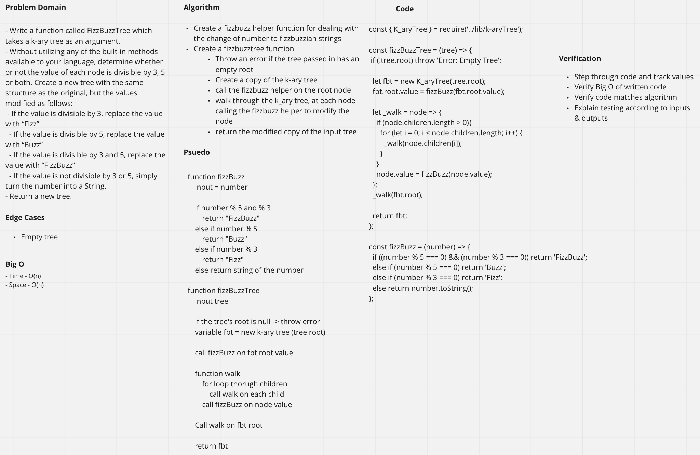

# Trees

## Challenge Summary 5/10/2021
<!-- Short summary or background information -->
Implement a find-maximum-value method in the tree data structure.

## Challenge Description
<!-- Description of the challenge -->
Write an instance method called find-maximum-value. Without utilizing any of the built-in methods available to your language, return the maximum value stored in the tree. You can assume that the values stored in the Binary Tree will be numeric.

## Approach & Efficiency
<!-- What approach did you take? Why? What is the Big O space/time for this approach? -->
- Time - O(n)
- Space - O(1)

## Solution
<!-- Embedded whiteboard image -->

---

## Challenge Summary 5/11/2021
<!-- Short summary or background information -->
Implement breadth first search on a binary tree

## Challenge Description
<!-- Description of the challenge -->
Write a breadth first traversal method which takes a Binary Tree as its unique input. Without utilizing any of the built-in methods available to your language, traverse the input tree using a Breadth-first approach, and return a list of the values in the tree in the order they were encountered.

## Approach & Efficiency
<!-- What approach did you take? Why? What is the Big O space/time for this approach? -->
- Time - O(n)
- Space - O(n)

## Solution
<!-- Embedded whiteboard image -->

---

## Challenge Summary 5/12/2021
<!-- Short summary or background information -->
Fizz Buzz a k-ary tree.

## Challenge Description
<!-- Description of the challenge -->
- Write a function called FizzBuzzTree which takes a k-ary tree as an argument.
- Without utilizing any of the built-in methods available to your language, determine whether or not the value of each node is divisible by 3, 5 or both. Create a new tree with the same structure as the original, but the values modified as follows:
  - If the value is divisible by 3, replace the value with “Fizz”
  - If the value is divisible by 5, replace the value with “Buzz”
  - If the value is divisible by 3 and 5, replace the value with “FizzBuzz”
  - If the value is not divisible by 3 or 5, simply turn the number into a String.
- Return a new tree.

## Approach & Efficiency
<!-- What approach did you take? Why? What is the Big O space/time for this approach? -->
- Time - O(n)
- Space - O(n)

## Solution
<!-- Embedded whiteboard image -->

