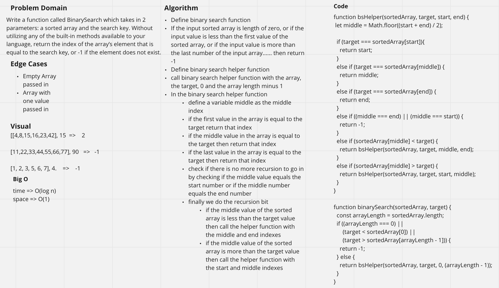

# Challenge Summary
<!-- Short summary or background information -->
Array Binary Search - find the index of an element in an array using a binary search

## Challenge Description
<!-- Description of the challenge -->
Write a function called BinarySearch which takes in 2 parameters: a sorted array and the search key. Without utilizing any of the built-in methods available to your language, return the index of the array’s element that is equal to the search key, or -1 if the element does not exist.

## Approach & Efficiency
<!-- What approach did you take? Why? What is the Big O space/time for this approach? -->
time -> O(log n)  
space -> O(1)

## Solution
<!-- Embedded whiteboard image -->

