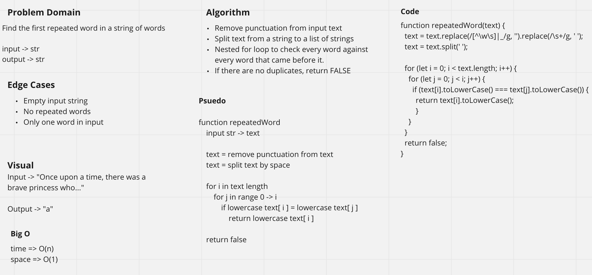

# Challenge Summary
<!-- Short summary or background information -->
Find the first repeated word in a book.

## Challenge Description
<!-- Description of the challenge -->
Write a function that accepts a lengthy string parameter.  
Return the first word to occur more than once in that provided string.

## Approach & Efficiency
<!-- What approach did you take? Why? What is the Big O space/time for this approach? -->
time -> O(n)
space -> O(1)

## Solution
<!-- Embedded whiteboard image -->

